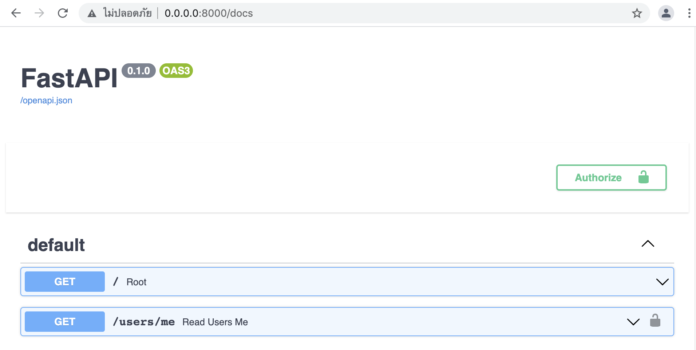
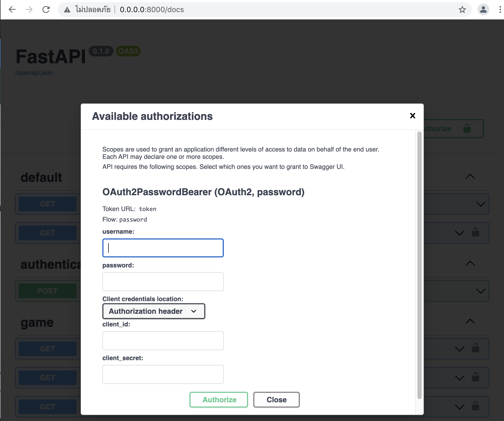
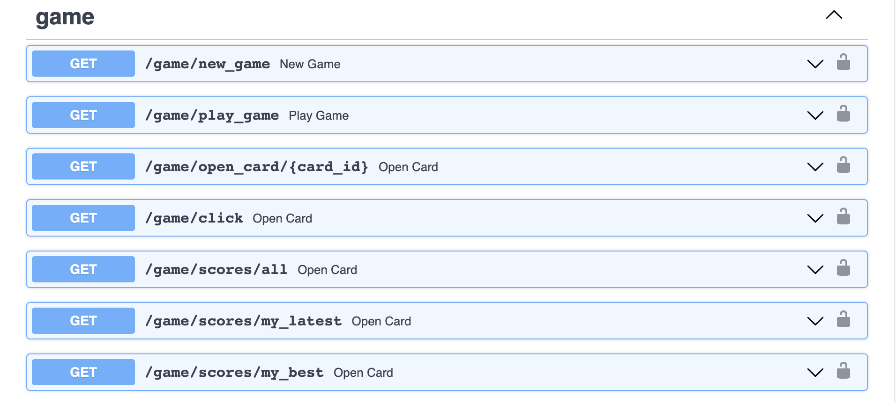

# card_game

## Deployment Step
1. Install Docker and start Docker
2. Clone this github repository (https://github.com/chotikalu/card_game.git)
3. Go to /card_game
4. Run `docker-compose build`
5. Run `docker-compose up`
6. Access the API docs using http://0.0.0.0:8000/docs

## Directory Structure
* src
  * model
    * game.py
    * token.py
    * user.py
  * Dockerfile
  * authentication.py
  * database.py
  * game.py
  * main.py
  * requirements.txt

## API Description
1. default 
   * `/` 
   * `/users/me` -> used to view user information
2. authentication 
   * `/token` -> used for requesting token
3. game 
   * `/game/new_game` -> used for starting a new game
   * `/game/play_game` -> used to start playing game
   * `/game/open_card/{card_id}` -> used for opening or selecting card
   * `/game/click` -> used for checking the number of clicks
   * `/game/scores/all` -> used for checking all scores that have been played
   * `/game/scores/my_latest` -> used for checking the latest score.
   * `/game/scores/my_best` -> used for checking the best score.

## Authentication
You can use username and password as follows.
> username: test  
password: test

## How to play games on the API Docs
1. Login authentication by click the authorize button  
  
2. Fill in the username and password 
  
3. Use `/game/play_game` to start the game
4. Use `/game/open_card/{card_id}` to open or select one card
   * Response will show value of card you opened or selected
   * If you cannot match the card, those card values are hidden.
   * You cannot open or select cards that show their values
5. Use `/game/new_game` to start the new game or restart game
6. Use `/game/click` to check your click count
7. Use `/game/scores/all`, `/game/scores/my_latest` or `/game/scores/my_best` to check your scores   

